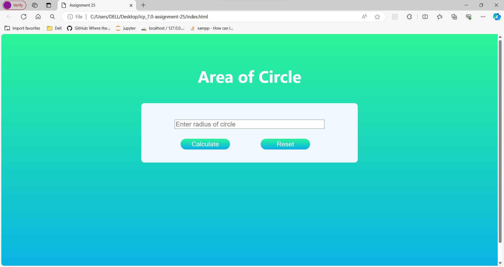

# Project-Name: icp_7.0-assignment-25

---
# Project-Title: Creating Area Calculator of Circle using HTML,CSS and Javascript 

---

The area of a circle calculator helps you compute the surface of a circle given a diameter or radius. Our tool works both ways no matter if you're looking for an area-to-radius calculator or a radius to the area one, you've found the right place

---
## Area Calculator of circle output

---
## How to Contribute 🪴💻

We welcome contributions from the community to help us expand and improve this handbook if you would like to contribute follow the steps:

1. Fork the repository to your GitHub account.
2. Make your changes ,add new content or fix the existing issues.
3. Open pull request in this repository.

---
## Contributors

Made with [contrib.rocks](https://contrib.rocks).